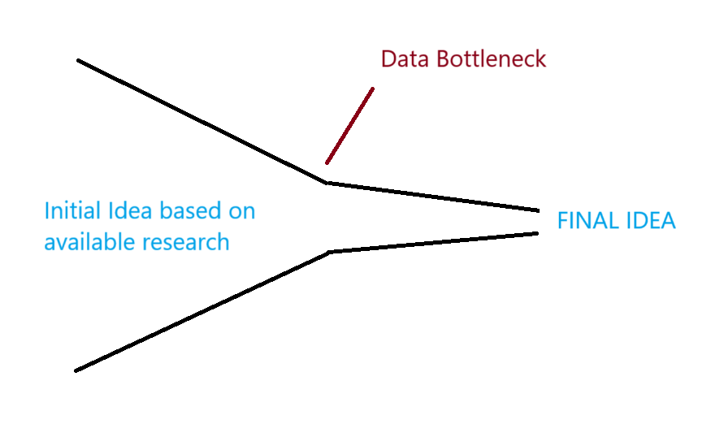

# End-to-End Scientific Writing

**Automating the Quantitative Research Process**

https://github.com/thomasschlatter/research-assistant.git

---

## Project Overview

This project aims to automate significant portions of the research writing process, from proposal generation to paper submission, using LLMs, Python, and various APIs.

The project makes use of **publicly available data** such as **OSF (Open Science Framework)** and **Semantic Scholar** to automate the paper writing process.

---

# Previous Research

Previous research, such as _The AI Scientist: Towards Fully Automated Open-Ended Scientific Discovery_ (Chris Lu et al.), is limited to machine learning subfields like diffusion modeling and transformer-based language modeling, highlighting the narrow applicability of such frameworks. Other research, such as Jansen et al. (2024), while encompassing diverse scientific domains, does not utilize real-world data.

---

# What is Science?

---

# Science Creates Surprising Connections

"interesting" scientific discovery:

- Takes concepts from one field and applies them in unexpected ways to other concepts (or the data of one field and applies it to another data in quantitative studies)
- Reveals hidden patterns across seemingly unrelated domains

**This is arguably very hard for LLMs**

---

## Core Features of the current approach (1/2)

- **Proposal Generation & Refinement:**
  - Generates research papers that is **not restricted to a research field**.
  - Refines proposals using **publicly available** research and repositories..
- **Paper Writing:**
  - Automatically generates sections (abstract, introduction, methods, etc.).
  - Most importantly: **Incorporates quantitative data analysis into the paper**.

---

## Core Features of the current approach (2/2)

- **Data Analysis:**
  - Downloads data from repositories (e.g., OSF).
  - Generates analysis.py for statistical analysis on-the-fly, based on the available data.
- **Journal Selection & Formatting:**
  - Recommends suitable journals.
  - Formats the final paper according to journal guidelines.

---

## Workflow

[View detailed workflow diagram](scientific_writer_assistant_flowchart.html)

1. **Proposal:** Generate and refine a research proposal.
2. **Literature Review:** Find and analyze relevant papers.
3. **Data Acquisition:** Identify and download datasets.
4. **Analysis:** Generate and run analysis scripts in Python using a fixed set of tools.
5. **Writing:** Generate and refine paper sections.
6. **Results Integration:** Incorporate analysis results into the paper.
7. **Journal Selection:** Find a target journal.
8. **Formatting:** Format the paper for submission.

---

## Technology Stack

- **Python:** Core programming language for workflow orchestration and API interaction.
- **OpenAI API:** Used for natural language processing tasks (proposal generation, section writing, etc.).
- **Tavily API:** Used for citation and bibliography information retrieval.
- **Other APIs:** OSF, Semantic Scholar, etc.

---

## Challenges (1/2)

- **Data Bottleneck:** Relies on the availability of suitable datasets and APIs. This is the real issue with this approach.

E.g. LLM wants to use PHOIBLE in research on Sound Symbolism, but can't because it's not available on OSF.

---

## Challenges (2/2)

- **Ethical Considerations:** Should we mimic the human research process (that adjusts the research question based on the outcomes) or should we go the "accepted route" of hypothesis formation and testing?

---

## To do

- **Include a review process:** Add another iterative level of review and editing to ensure the quality of the final paper.
- **Integration with Text Embeddings for the paper abstracts:** Use text embeddings to summarize the paper abstracts to circumvent context issues.
- **Advanced Analytics:** Incorporate more sophisticated data analysis techniques.

---

## Conclusion

This project has the potential to completely automate the research writing process if key challenges are addressed:

- **Data Availability:** Ensure the availability of relevant datasets and APIs.
- **Quality Control:** Implement a robust review process to ensure the quality of the final paper.

At this stage, the quantitative parts of the paper probably do not meet journal standards given the data bottleneck.

---

# Q&A

---

# Sources

Lu, C., Lu, C., Lange, R. T., Foerster, J., Clune, J., & Ha, D. (2023). The AI Scientist: Towards Fully Automated Open-Ended Scientific Discovery. arXiv preprint. Retrieved from https://arxiv.org/abs/2304.05332

Jansen, P., Côté, M. A., Khot, T., Bransom, E., Mishra, B. D., Majumder, B. P., Tafjord, O., & Clark, P. (2024). DISCOVERYWORLD: A Virtual Environment for Developing and Evaluating Automated Scientific Discovery Agents. arXiv preprint arXiv:2411.14051.
